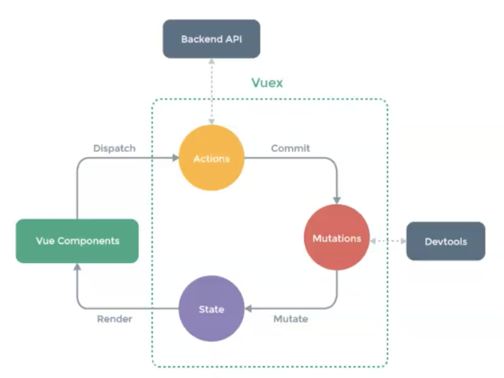

# vuex

## vuex 状态管理模式

- 单项数据流, 易于问题追踪以及提高代码可维护性
  
- 解决多视图依赖同一数据
- 基本使用
  - 数据存放在store内
  - 组件不能改,只能dispatch->Actions, commit->Mutations
  - 数据更改后通知组件
  - Actions调用Mutations修改状态(能改状态的只有Mutations)
- 核心概念
  - state 状态/数据
  - mutations 更改状态的函数x
  - actions 异步操作/复杂业务逻辑
  - store 包含以上概念的容器
- 抽取出来vue模块, 设置namespace命名空间, 使用的时候dispatch('namespace/xxx')

### 实现vuex
#### 任务分析 
- 实现Store类
  - state响应化处理方案
  - 保存状态, 实现dispatch, commit, getters
- 实现插件
  - 挂载store实例